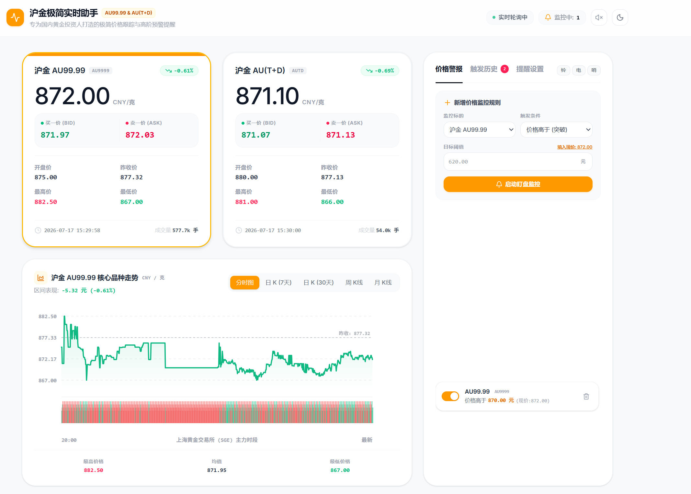
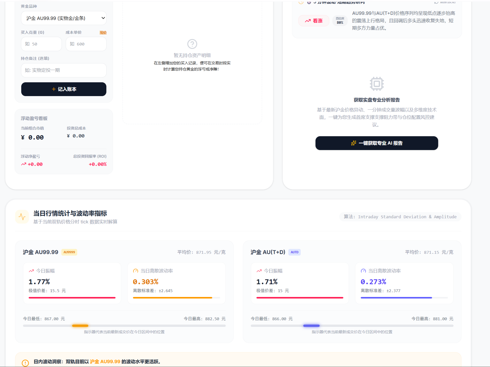

# 🪙 SGE 沪金价格智能监控与分析助手 (SGE Gold Monitor Assistant)

这是一个专为个人投资者打造的**上海黄金交易所（SGE）沪金行情实时监控、持仓盈亏计算、AI 智能盘面深度研报分析以及邮件/声音多维度预警提醒**的综合智能系统。

项目全面适配了 **Cloudflare Workers** 服务端架构（使用 [Hono](https://hono.dev/) 框架），实现了前端 React (Vite) 静态资源与后端 API 的前后端一体化极速托管部署，提供 24 小时无人值守的自动化黄金行情巡检与云端预警推送服务。

---

## 🖥️ 运行效果截图

| 📈 黄金价格实时行情主控面板 | 🤖 AI 智能分析研判与精美海报 |
| :---: | :---: |
|  |  |

---

## 🌟 核心功能

* **📈 实时黄金行情监控 (SEO Keyword: 上海黄金交易所行情)**：同步拉取新浪财经和东方财富数据，提供上海金主力合约（**AU99.99 现货**与 **AU T+D 递延合约**）的实时买一卖一价、今日涨跌幅、日内波幅、成交量以及今日分时趋势图。
* **🤖 多模型 AI 智能黄金研判 (DeepSeek / OpenAI / Gemini)**：一键生成深度黄金行情研判报告！系统已无缝支持 **DeepSeek-R1/V3、OpenAI GPT-4o、Google Gemini、通义千问 (Qwen)、Claude** 等多种国内外主流大模型 API。自动结合美联储利率政策、美元指数、国际伦敦金 (XAU) 溢价等宏观金融背景，精准计算第一/第二支撑位与阻力位，并自动生成专业级“沪金智能分析研判报告”。
* **🎨 研报高保真海报一键分享**：生成的 AI 研报支持**一键生成高保真海报图片**（内置日内波动区间可视化指示条、报价看板、风险提示等专业元素），支持一键下载或一键复制到剪贴板；同时提供**云端专属网页分享链接**（30天自动过期），方便在微信、社群或邮件中快捷分享。
* **⏱️ 5分钟波动微研判**：基于黄金近 5 个交易周期的价格波动，结合大模型结构化输出与本地量化算法进行极短期趋势判定（看涨/看跌/震荡）及置信度输出。
* **📊 历史 K 线深度分析**：无缝拉取并聚合沪金历史日 K、周 K、月 K 数据，提供直观的走势图表展示。
* **🔔 24H 云端无人值守预警 (Cron Triggers)**：
  - **云端定时巡检**：设置 Cloudflare Cron Triggers 定时任务（默认每 2 分钟触发一次），即使彻底关闭浏览器或电脑，云端依然会自动巡检价格，触发规则后自动推送邮件。
  - **夜盘静音模式**：专为沪金夜盘时间定制（20:00 - 02:30），可设置为“正常提醒”、“免打扰（完全静音）”或“仅大级别波动提醒（波幅 >= 0.5%）”。
  - **多邮箱预警推送**：支持将预警邮件同时推送至多个邮箱。
  - **声音警报**：支持高低触价浏览器鸣笛报警。
* **✉️ 极速邮件发送通道**：
  - **Resend API (推荐)**：使用基于 Serverless HTTPS 协议 of Resend 服务发信，100% 避免被国内邮箱服务商封锁，发信极为高效。
  - **SMTP 服务器**：支持用户在页面上手动配置个人邮箱 SMTP（如 QQ 邮箱、163 邮箱）进行发信。
* **📊 持仓盈亏计算器**：支持记录多次购入实物金/积存金的单价及克重，并依据当前最新实时金价自动计算累计持仓成本、总盈亏和投资收益率。

---

## 🛠️ 技术栈

* **前端**：React 19, TypeScript, Vite 6, Tailwind CSS 4, Motion (动画), Lucide React (图标)
* **后端**：Hono (运行在 Cloudflare Workers V8 沙箱环境)
* **大模型服务**：DeepSeek API, OpenAI API, Google Gemini SDK (`@google/genai`)
* **邮件推送**：Resend API, Nodemailer
* **部署平台**：Cloudflare Workers with Assets (前后端一体化部署)

---

## 📦 本地快速开始

### 1. 克隆与安装依赖
确保您已安装 Node.js (推荐 v20 或更高版本)。
```bash
git clone https://github.com/yourusername/sge-gold-monitor.git
cd sge-gold-monitor
npm install
```

### 2. 本地秘钥配置
在项目根目录下创建一个名为 **`.dev.vars`** 的文件，填入您的密钥：
```env
# =================================================================
# AI 大模型接口配置 (任选其一或配置多个，系统会自动按优先级降级 fallback)
# =================================================================

# 1. DeepSeek API 配置 (优先使用)
DEEPSEEK_API_KEY="您的_DeepSeek_API_Key"
DEEPSEEK_MODEL="deepseek-chat" # 或 deepseek-reasoner

# 2. OpenAI 或 兼容端配置 (如 OneAPI、OpenRouter、通义千问等)
OPENAI_API_KEY="您的_OpenAI_API_Key"
OPENAI_BASE_URL="https://api.openai.com/v1" # 支持配置自定义兼容中转端
OPENAI_MODEL="gpt-4o"

# 3. Google Gemini 官方配置
GEMINI_API_KEY="您的_Gemini_API_Key"
GEMINI_MODEL="gemini-3.5-flash"

# =================================================================
# 邮件发信服务配置
# =================================================================
# Resend API 密钥 (选填，用于邮件预警推送)
RESEND_API_KEY="re_您的_Resend_API_Key"
```

### 3. 本地启动开发
本项目需要分别运行前端和后端服务：

* **启动后端 API 服务 (Wrangler/Hono)**:
  ```bash
  npm run dev:worker
  ```
  *服务默认运行在 `http://localhost:8787`*

* **启动前端 Vite 服务**:
  ```bash
  npm run dev
  ```
  *前端服务默认运行在 `http://localhost:5173`。Vite 已配置代理，所有 `/api` 路径的请求会自动转发到本地的 Worker 端口上。*

---

## 🌐 Cloudflare Workers 线上部署指南

本系统完美契合 Cloudflare Workers 的最新 **Workers with Assets** 特性，在一次部署中，由 Cloudflare 自动打包并分发前端静态文件与 Hono API。

### 1. 登录并授权
在终端中登录您的 Cloudflare 账号：
```bash
npx wrangler login
```

### 2. 配置线上加密变量 (Secrets)
前往 Cloudflare 线上储存您的密钥（避免将其暴露在公开的代码库中）：
```bash
# 写入您想使用的大模型 Key
npx wrangler secret put DEEPSEEK_API_KEY
npx wrangler secret put OPENAI_API_KEY
npx wrangler secret put GEMINI_API_KEY

# 写入 Resend 邮件秘钥
npx wrangler secret put RESEND_API_KEY
```
*(您也可以直接登录 [Cloudflare Dashboard 网页后台](https://dash.cloudflare.com/)，在您的 Worker 设置中的 `Settings -> Variables` 里添加这两项变量。为了防止重新部署时普通变量被清空，请统一选择 **Encrypt (加密)** 将变量保存为 Secret。)*

### 3. 一键编译并部署
执行以下指令，Vite 会自动构建前端，Wrangler 会自动上传并部署至云端：
```bash
npm run deploy
```
发布成功后，控制台会输出一个类似于 `https://gold-prices-sge.<您的子域名>.workers.dev` 的链接，这便是您的专属黄金分析监控主页。

---

## ⚙️ 配置文件说明

### `wrangler.toml`
这是 Cloudflare Workers 的部署配置文件。
```toml
name = "gold-prices-sge"
main = "src/worker.ts"
compatibility_date = "2026-01-01"
compatibility_flags = [ "nodejs_compat" ] # 启用 Node.js 兼容层以支持外部第三方包

[assets]
directory = "./dist" # 指向 Vite 打包后的静态资源目录

[triggers]
crons = [ "*/2 * * * *" ] # 开启 2 分钟一次的云端巡检定时器

[[kv_namespaces]]
binding = "GOLD_RULES_KV"
id = "您的_Cloudflare_KV_Namespace_ID"
```

---

## 🔒 邮件服务配置指南 (Resend 与 SMTP)

1. **若配置了 `RESEND_API_KEY` (最推荐)**：
   - 邮件推送将优先通过 Resend 发送。
   - **注意**：使用 Resend 的免费测试账户时，在未绑定独立域名的情况下，发件人固定为 `onboarding@resend.dev`，且**收信人仅限您自己注册 Resend 时的邮箱账号**。如果需要发送到其他邮箱，请在 Resend 控制台中绑定并验证您自己的域名。
2. **若使用国内 SMTP 服务 (例如 QQ/163 邮箱)**：
   - 您可以直接在前端页面的「设置 -> 高级发件设置」中输入您的邮箱配置参数。
   - **注意**：填写的密码必须是邮箱的**“授权码”**，而不是日常登录密码。同时，Cloudflare 线上境外节点 IP 有时会被国内邮件服务商（QQ、163 等）出于垃圾邮件防护目的直接屏蔽，可能会导致线上发送失败（本地运行则不受此限制）。

---

## 📄 开源许可证

本项目基于 [Apache-2.0 License](LICENSE) 开源许可证。
